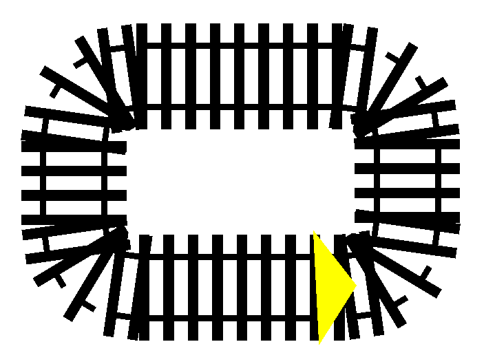

# Simulation Info

## Setup

- **Purpose**: Test a single vehicle on a simple track layout.
- **Network**: Single stretched cirlce.
- **Vehicles**: One vehicle.
- **Environment**: No crossings, signals, or stations.
- **Passengers**: None.
- **Output**: Vehicle position over time.
- **Configuration**: `sumo/sim1/rail.sumocfg`.

## Visualization

## Results

TODO
